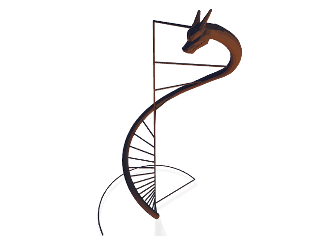

# DragonDiagrams

🐉📈

Generate dragon diagrams from uvfits using Blender



## Repo Structure

- **tools** - Python utility scripts that mostly interface with Blender
  - **dragon_diagram.py** - 🐉📈
- **tests** - Tests for Python Utilities
- **3d** - 3d asset location
- **data** - put uvfits files here

## Python Utility Scripts (`tools`)

### Setup

If you are using VSCode, it's helpful to point your editor to use the Python included in Blender.
Determine your blender Python location, and add it to your `.vscode/settings.json`

```json
{
  ...
  "python.pythonPath": "/Applications/Blender.app/Contents/Resources/2.80/python/bin/python3.7m",
  # on windows
  "python.pythonPath": "C:\\Program Files\\Blender Foundation\\Blender 3.1\\3.1\\python\\bin\\python.exe"
}
```

To run the scripts on your model file, you will need to install the script's dependencies into
Blender's internal Python environment.

### Windows

on Windows, you need to follow [these instructions](https://b3d.interplanety.org/en/installing-python-packages-with-pip-in-blender-on-windows-10/?msclkid=1069d06ad00c11eca9d7f769e923ccf2)

First, give full access to your user for the directory `C:\Program Files\Blender Foundation\Blender 3.1\3.1\python\lib\site-packages`

then

```powershell
& "C:\Program Files\Blender Foundation\Blender 3.1\3.1\python\bin\python.exe" -m pip install -r tools/requirements.txt --target "C:\Program Files\Blender Foundation\Blender 3.1\3.1\python\lib\site-packages"
```

### MacOS

```bash
/Applications/Blender.app/Contents/Resources/2.80/python/bin/python3.7m -m pip install -r tools/requirements.txt
```

Modify the file `script_wrapper.py` so that `REPO_DIR` points to the absolute path of the `tools`
folder of this repo and `things_to_run` points to the Python modules you want to run.

### Usage

Open your Blender file containing your LED model from a terminal. If blender was installed with
`brew cask` you will have access to a `blender` command, otherwise you can just call the full name
of the blender executable.

```bash
blender your_model.blend
```

Then, in the Scripting tab, open the file `script_wrapper.py` and click `Run Script`. The script
will output to the terminal from which Blender was initially run, as well as a log file in the root
of the repo.

Note: because of the weird way these files are imported in Blender, you need to reload the script
each time it is modified by an external program. It is recommended not to edit the file in Blender
because it's a pretty shitty IDE, and it won't save the changes back to the repo.
